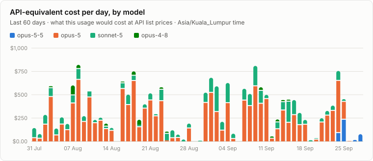
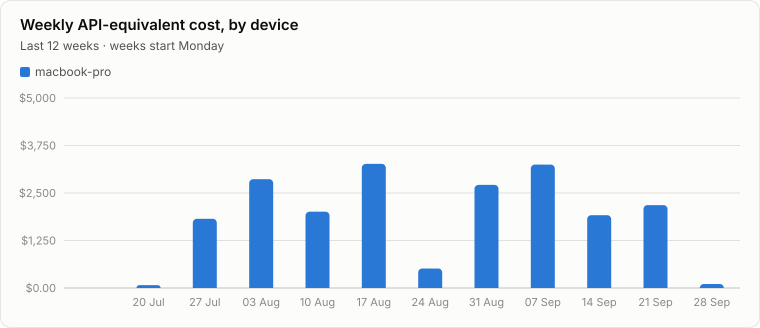
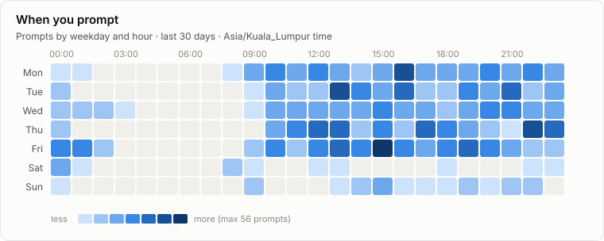
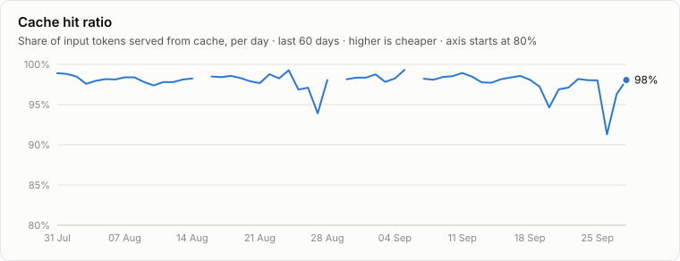

# Claude usage

Claude Code usage across all my devices, rebuilt automatically every day (and after every sync). Times are Asia/Kuala_Lumpur. Updated 2026-09-28.

Tracking since 2026-07-25 · 1 device · 114,241 replies · 3,881 prompts

## At a glance

|  | Last 7 days | vs previous 7 | Last 30 days | All time |
| --- | ---: | ---: | ---: | ---: |
| API-equivalent cost | $2,040 | ▲ 19% | $10,169 | $20,709 |
| Output tokens | 7.4M | ▼ 12% | 38.2M | 80.1M |
| Prompts | 363 | ▼ 6% | 1,944 | 3,881 |
| Sessions | 27 | ▼ 18% | 126 | 364 |
| Active hours | 70 | ▲ 8% | 314 | 710 |
| Active days | 7 / 7 |  | 29 / 30 | 63 |
| Cache hit ratio | 98% |  | 98% | 98% |




### Models, last 30 days

| Model | Replies | Output | API cost | Share |
| --- | ---: | ---: | ---: | ---: |
| claude-opus-5 | 26,730 | 22.4M | $7,196 | 71% |
| claude-sonnet-5 | 17,883 | 12.8M | $2,426 | 24% |
| claude-opus-5-5 | 2,560 | 2.9M | $462 | 5% |
| claude-opus-4-8 | 201 | 207.2K | $85.32 | 1% |

## Where and when



| Device | Last active | Cost, 30 days | Sync |
| --- | ---: | ---: | ---: |
| macbook-pro | 2026-09-28 | $10,169 | ok |




### Heaviest 5-hour windows, last 30 days

Subscription limits count usage in 5-hour windows, so these are the stretches closest to a limit.

| Window start | API cost | Output | Main models | Devices |
| --- | ---: | ---: | --- | --- |
| Tue 01 Sep 10:00 | $390 | 987.2K | opus-5, sonnet-5 | macbook-pro |
| Wed 16 Sep 09:00 | $385 | 2.5M | opus-5, sonnet-5 | macbook-pro |
| Thu 24 Sep 10:00 | $381 | 1.3M | opus-5, opus-5-5 | macbook-pro |
| Wed 09 Sep 14:00 | $378 | 1.3M | opus-5, sonnet-5 | macbook-pro |
| Wed 02 Sep 20:00 | $303 | 1.1M | opus-5, sonnet-5 | macbook-pro |

## How you work



| Habit (last 30 days) | Value |
| --- | ---: |
| Work done by subagents (share of cost) | 2% |
| Prompts per session (average) | 16.1 |
| Prompt length (median characters) | 144 |
| Replies you interrupted | 103 |
| 5-hour windows used | 81 (2.8 per active day) |
| Effort setting mix | high 95%, medium 5% |
| Where you use it | vscode 84%, desktop 16% |

<table><tr><td valign="top">

**Top tools**

| Tool | Calls |
| --- | ---: |
| Bash | 35,214 |
| Read | 2,975 |
| Edit | 2,527 |
| Write | 920 |
| Claude_Browser: computer | 655 |
| Claude_Browser: javascript_tool | 457 |
| WebFetch | 410 |
| Artifact | 331 |
| Claude_Browser: browser_batch | 320 |
| WebSearch | 288 |

</td><td valign="top">

**Skills**

| Skill | Uses |
| --- | ---: |
| browse | 23 |
| artifact-design | 21 |
| handoff | 19 |
| design-shotgun | 8 |
| design | 7 |
| artifact-capabilities | 7 |
| design-consultation | 7 |
| connect-chrome | 6 |
| lane | 6 |
| dataviz | 5 |

</td><td valign="top">

**Slash commands**

| Command | Uses |
| --- | ---: |
| /model | 375 |
| /lane | 47 |
| /usage-report | 3 |
| /update-config | 1 |
| /server-connectivity | 1 |
| /ultrareview | 1 |

</td></tr></table>

## Data

- [`reports/dashboard.html`](reports/dashboard.html): the same report with hover values (download and open)
- [`reports/daily.csv`](reports/daily.csv): one row per day × device × project × model
- [`reports/weekly/`](reports/weekly/): one summary per week
- Costs are API list prices from [`report/pricing.json`](report/pricing.json), for comparison only: a subscription is not billed per token.

## Set up a device

Each device syncs its own Claude Code usage here every day at **08:00 Malaysia time**, and after every Claude Code session ends. Nothing needs to be done after installing.

**macOS / Linux** (needs `git`, `python3`, and push access to this repo, e.g. via `gh auth login`):

```bash
git clone --filter=blob:none --no-checkout https://github.com/mariiaivanovacs/claude-usage.git ~/.claude-usage/repo
cd ~/.claude-usage/repo && git sparse-checkout set --no-cone '/*' '!/devices/*' && git checkout main
./install/install.sh
```

**Windows** (PowerShell; needs Git and Python 3):

```powershell
git clone --filter=blob:none --no-checkout https://github.com/mariiaivanovacs/claude-usage.git $HOME\.claude-usage\repo
cd $HOME\.claude-usage\repo; git sparse-checkout set --no-cone '/*' '!/devices/*'; git checkout main
powershell -ExecutionPolicy Bypass -File install\install.ps1
```

The installer asks for a device name, schedules the daily run (launchd on macOS, a systemd timer on Linux, Task Scheduler on Windows), adds a `SessionEnd` hook to `~/.claude/settings.json`, raises `cleanupPeriodDays` to 365 so transcripts aren't deleted before they sync, and imports all existing history. Each device only downloads and checks out its own `devices/<name>/` folder, so the clone stays small as history grows.

Remove it: run the same installer with `--uninstall` (Windows: `-Uninstall`).

### What is collected

Metadata only, per model reply: time, model, token counts, project (git remote, e.g. `owner/repo`, or the folder name), branch, short session id, tools called, skills used, effort setting, whether a subagent did it. Per prompt: time and length. **Never the text of prompts, replies, files or commands.**

### Settings

- `config.json`: time zone for the report, and `plan_monthly_usd` / `plan_name` to compare API-equivalent cost with your subscription.
- `aliases.json`: rename or merge projects, e.g. `{"website": "geco-ai-labs/sg_geco-ai_websitepoc"}`.
- `report/pricing.json`: API list prices used for the cost figures.
- Run the report by hand: `python3 report/build.py`. Run a device sync by hand: `python3 collector/collect.py`. Log: `~/.claude-usage/collect.log`.
