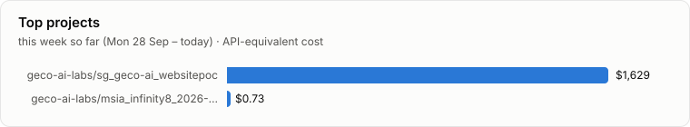
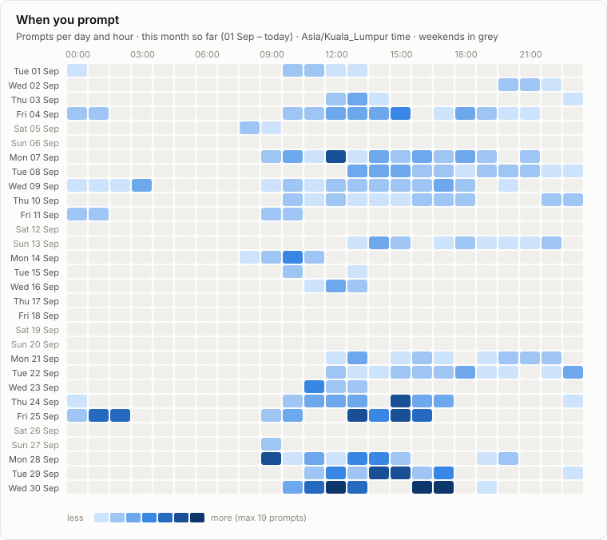
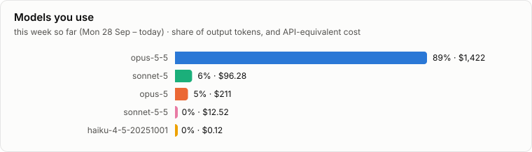

# Claude usage

Tracking since 2026-07-28 · 1 device · 44,820 replies · 1,608 prompts

**Jump to:** [mariia-macbook](#device-mariia-macbook) · [Weekly limit](#weekly-limit) · [By month](#by-month)

## Device: mariia-macbook

**This week so far (Mon 28 Sep – today):**  
4.2B input · 11.8M output · 98% from cache · 327 prompts · $1,735 API-equivalent  
vs the same days last week: output ▲ 131% · prompts ▲ 34% · cost ▲ 37%

## Weekly limit

**Weekly limit used** is the % that Claude's own `/usage` screen shows. Claude Code doesn't let scripts read it, so record it yourself: open `/usage`, then type **`/log-usage 42`** in Claude Code (42 = the weekly % it shows). The table keeps the latest reading of each week; the other columns fill in by themselves.

### September 2026

| Week (Mon–Sun) | Weekly limit used | 5-hour windows run out | Locked out | Sessions | Status |
| --- | ---: | ---: | ---: | ---: | --- |
| 07 Sep – 13 Sep | – | 2 | 1h 39m | 13 | final |
| 14 Sep – 20 Sep | – | 1 | 1h 32m | 5 | final |
| 21 Sep – 27 Sep | – | 0 | – | 9 | final |
| 28 Sep – 04 Oct | – | 6 | 5h 24m | 15 | in progress |

## By month

Tokens are input (including what is read from cache) / output. Weekly limit used is the average of that month's weekly `/usage` readings.

| Month | Tokens in / out | Sessions | Prompts | Devices | Windows run out | Locked out | Weekly limit used | Status |
| --- | ---: | ---: | ---: | ---: | ---: | ---: | ---: | --- |
| 2026-10 | 1.2B / 2.8M | 6 | 92 | 1 | 2 | 37 min | – | in progress |
| [2026-09](archive/2026-09.json) | 10.3B / 23.2M | 44 | 838 | 1 | 8 | 8h 57m | – | final |
| [2026-08](archive/2026-08.json) | 3.9B / 6.3M | 41 | 540 | 1 | 0 | – | – | final |
| [2026-07](archive/2026-07.json) | 2.3B / 3M | 10 | 138 | 1 | 0 | – | – | final |

## Data

- [`archive/`](archive/): one JSON file per finished month, per device and in total
- [`reports/daily.csv`](reports/daily.csv): one row per day × device × project × model
- [`reports/dashboard.html`](reports/dashboard.html): this report with hover values (download and open)
- Costs are API list prices from [`report/pricing.json`](report/pricing.json), for comparison only: a subscription is not billed per token. Models marked * are priced by their family.
- [`SETUP.md`](SETUP.md): set up a device, keep projects out, record `/usage`, rename a device
