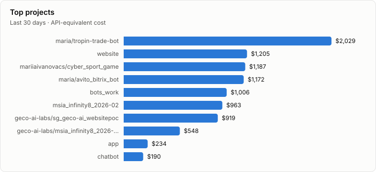
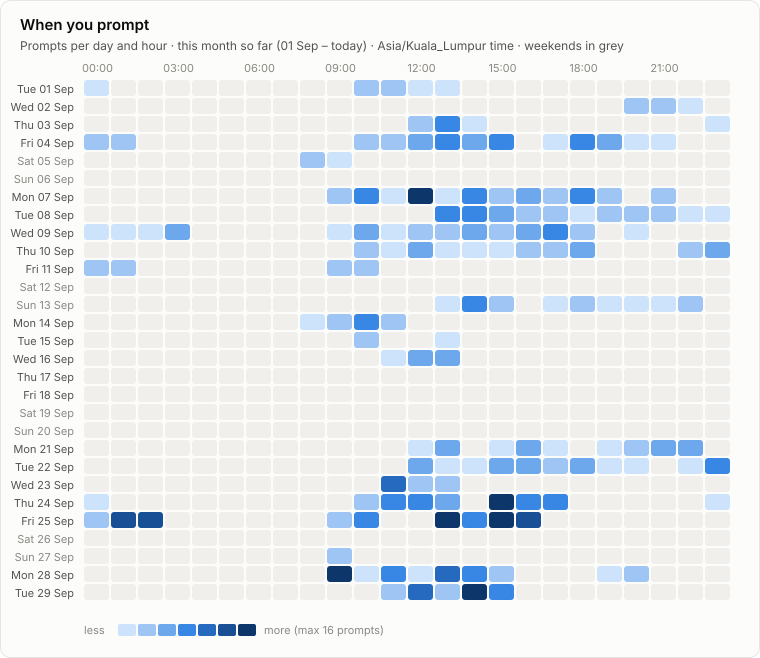

# Claude usage

Claude Code usage across all my devices, rebuilt automatically every day (and after every sync). Weeks start Monday; times are Asia/Kuala_Lumpur. Updated 2026-09-28.

Tracking since 2026-07-28 · 1 device · 33,949 replies · 1,318 prompts

**Jump to:** [macbook-pro](#device-macbook-pro) · [Plan](#plan) · [By month](#by-month)

## Device: macbook-pro

**This week so far (Mon 28 Sep – today):**  
294.5M input · 624.9K output · 98% from cache · 37 prompts · $121 API-equivalent  
vs the same days last week: output ▼ 15% · prompts ▲ 12% · cost ▼ 28%






## Plan

_Set your plan to see the % of its price used each week: `python3 collector/collect.py plan "Max 20x" 200`._

Only projects this tracker collects are counted. **/usage** is the weekly-limit % you recorded by hand that week (the latest reading; the limit resets on its own schedule, not on Mondays).

### September 2026

| Week (Mon–Sun) | API cost | % of plan's weekly price | /usage | Status |
| --- | ---: | ---: | ---: | --- |
| 07 Sep – 13 Sep | $1,585 | – | – | final |
| 14 Sep – 20 Sep | $197 | – | – | final |
| 21 Sep – 27 Sep | $1,267 | – | – | final |
| 28 Sep – 04 Oct | $121 | – | – | in progress |

### August 2026

| Week (Mon–Sun) | API cost | % of plan's weekly price | /usage | Status |
| --- | ---: | ---: | ---: | --- |
| 03 Aug – 09 Aug | $35.96 | – | – | final |
| 10 Aug – 16 Aug | $801 | – | – | final |
| 17 Aug – 23 Aug | $697 | – | – | final |
| 24 Aug – 30 Aug | $284 | – | – | final |
| 31 Aug – 06 Sep | $802 | – | – | final |

_Record a reading: open `/usage` in Claude Code, then run `python3 ~/.claude-usage/repo/collector/collect.py usage 42` (add `--session 15`, `--resets "Thu 10:00"`, or `--at "2026-09-28 14:30"` for an earlier reading)._

## By month

| Month | API cost | Output | Prompts | Most-used device | Status |
| --- | ---: | ---: | ---: | --- | --- |
| 2026-09 | $3,811 | 14.8M | 640 | macbook-pro | in progress |
| [2026-08](archive/2026-08.json) | $2,109 | 6.3M | 540 | macbook-pro | final |
| [2026-07](archive/2026-07.json) | $561 | 3M | 138 | macbook-pro | final |

## Data

- [`archive/`](archive/): one JSON file per finished month, per device and in total
- [`reports/daily.csv`](reports/daily.csv): one row per day × device × project × model
- [`reports/dashboard.html`](reports/dashboard.html): this report with hover values (download and open)
- Costs are API list prices from [`report/pricing.json`](report/pricing.json), for comparison only: a subscription is not billed per token.

## Set up a device

Each device syncs its own Claude Code usage here every day at **08:00 Malaysia time**, and after every Claude Code session ends. Nothing needs to be done after installing.

**macOS / Linux:** copy [`setup-device.sh`](setup-device.sh) to the device and run it:

```bash
bash setup-device.sh
```

It checks git, python3 and GitHub access (and signs you in with `gh` if needed), downloads the tracker, then asks what to call the device. **That name is what the dashboard and its charts show ("Device: work-laptop")**, so pick one you'll recognise.

**Windows** (PowerShell; needs Git and Python 3):

```powershell
git clone --filter=blob:none --no-checkout https://github.com/mariiaivanovacs/claude-usage.git $HOME\.claude-usage\repo
cd $HOME\.claude-usage\repo; git sparse-checkout set --no-cone '/*' '!/devices/*'; git checkout main
powershell -ExecutionPolicy Bypass -File install\install.ps1
```

The installer asks for a device name, schedules the daily run (launchd on macOS, a systemd timer on Linux, Task Scheduler on Windows), adds a `SessionEnd` hook to `~/.claude/settings.json`, raises `cleanupPeriodDays` to 365 so transcripts aren't deleted before they sync, and imports all existing history. Each device only downloads and checks out its own `devices/<name>/` folder, so the clone stays small as history grows.

Remove it: run the same installer with `--uninstall` (Windows: `-Uninstall`).

### What is collected

Metadata only, per model reply: time, model, token counts, project (git remote, e.g. `owner/repo`, or the folder name), branch, short session id, tools called, skills used, effort setting, whether a subagent did it. Per prompt: time and length. **Never the text of prompts, replies, files or commands.**

### Keep a project out of the tracker

Excluded projects are dropped on the device itself, so nothing about them is written or pushed. Run these on the device (`~/.claude-usage/repo/collector/collect.py`; on Windows `python` instead of `python3`):

```bash
python3 collect.py exclude list                                # patterns + every project seen on this device
python3 collect.py exclude add "owner/some-repo"               # a project name (from the list)
python3 collect.py exclude add "*client*"                      # a name pattern
python3 collect.py exclude add "~/Desktop/private"             # a folder and everything inside it
python3 collect.py exclude add "owner/some-repo" --shared          # all devices (goes into exclude.json)
python3 collect.py exclude remove "*client*"                   # un-exclude: its history is re-imported
python3 collect.py only add "~/Desktop/client-work"             # allow-list: keep ONLY matching projects
python3 collect.py only add "my-org/*"                          # (folders or repo names; exclude still applies inside)
python3 collect.py only remove "my-org/*"
```

- `only` is an allow-list: once it has any pattern, every other project on that device is dropped, including new ones. A folder pattern checks where Claude actually worked, so a session started in an allowed folder that moves into another repo stays out.

- Without `--shared` the pattern stays in `~/.claude-usage/config.json` on that device and is never pushed, so the repo doesn't even show which projects are hidden.
- With `--shared` it goes into [`exclude.json`](exclude.json) and every device applies it on its next sync.
- Adding a rule also removes that project's already-pushed data from the device's files; removing one re-imports it from the local logs. Commit messages don't say what was hidden, but older commits still contain the data until the repo history is rewritten.

### Plan and /usage readings

```bash
python3 ~/.claude-usage/repo/collector/collect.py plan "Max 20x" 200    # once: plan name and USD per month
python3 ~/.claude-usage/repo/collector/collect.py usage 42              # the weekly % that /usage shows now
python3 ~/.claude-usage/repo/collector/collect.py usage 42 --session 15 --resets "Thu 10:00"
python3 ~/.claude-usage/repo/collector/collect.py usage 38 --at "2026-09-27 21:00"   # a reading taken earlier
```

The **Plan** section shows, per calendar month, each Monday–Sunday week's API-equivalent cost as a % of the plan's weekly price (monthly × 12 ÷ 52), next to the latest `/usage` reading recorded that week. Past weeks stay fixed; the current week grows until Sunday. Readings are stored in `limits/<device>.jsonl` and kept in the monthly archive.

### Rename a device

`python3 collect.py rename new-name` moves the device's data folder in the repo (history stays) and updates its local config. The name shows as "Device: new-name" in the report.

### Settings

- `config.json`: time zone for the report, `device_order` (e.g. `["macbook-pro", "work-pc", "home-pc"]`) for the order of the device sections, and `plan_monthly_usd` / `plan_name` to compare API-equivalent cost with your subscription.
- `aliases.json`: rename or merge projects, e.g. `{"website": "my-org/website"}`.
- `report/pricing.json`: API list prices used for the cost figures.
- Run the report by hand: `python3 report/build.py`. Run a device sync by hand: `python3 collector/collect.py`. Log: `~/.claude-usage/collect.log`.
