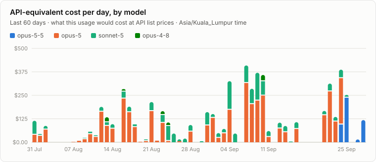
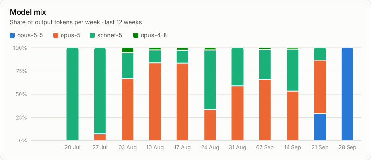
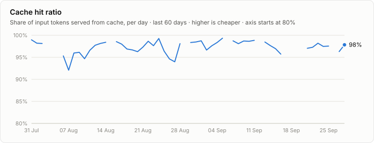

# Claude usage

Claude Code usage across all my devices, rebuilt automatically every day (and after every sync). Times are Asia/Kuala_Lumpur. Updated 2026-09-28.

Tracking since 2026-07-28 · 1 device · 33,900 replies · 1,316 prompts

**Jump to:** [macbook-pro](#device-macbook-pro)

| Device | Cost, 7 days | Cost, 30 days | Output, 30 days | Last active | Sync |
| --- | ---: | ---: | ---: | ---: | --- |
| [macbook-pro](#device-macbook-pro) | $1,215 | $3,972 | 15.2M | 2026-09-28 | ok |

## Device: macbook-pro

|  | Last 7 days | vs previous 7 | Last 30 days | All time |
| --- | ---: | ---: | ---: | ---: |
| API-equivalent cost | $1,215 | ▲ 338% | $3,972 | $6,476 |
| Output tokens | 5M | ▲ 113% | 15.2M | 24M |
| Prompts | 246 | ▲ 382% | 680 | 1,316 |
| Sessions | 10 | ▲ 43% | 35 | 80 |
| Active hours | 55 | ▲ 244% | 190 | 391 |
| Active days | 6 / 7 |  | 23 / 30 | 52 |
| Cache hit ratio | 98% |  | 98% | 98% |





### Models, last 30 days

| Model | Replies | Output | API cost | Share |
| --- | ---: | ---: | ---: | ---: |
| claude-opus-5 | 9,375 | 7.4M | $2,533 | 64% |
| claude-sonnet-5 | 6,918 | 4.8M | $939 | 24% |
| claude-opus-5-5 | 2,629 | 3M | $472 | 12% |
| claude-opus-4-8 | 98 | 81.8K | $28.07 | 1% |


### Heaviest 5-hour windows, last 30 days

Subscription limits count usage in 5-hour windows across all devices, so these are the stretches closest to a limit.

| Window start | API cost | Output | Main models | Devices |
| --- | ---: | ---: | --- | --- |
| Thu 24 Sep 10:00 | $242 | 1M | opus-5, opus-5-5 | macbook-pro |
| Wed 09 Sep 14:00 | $218 | 509.7K | opus-5, sonnet-5 | macbook-pro |
| Thu 10 Sep 15:00 | $186 | 423.6K | opus-5, opus-4-8 | macbook-pro |
| Mon 07 Sep 14:00 | $181 | 468.4K | opus-5, sonnet-5 | macbook-pro |
| Tue 08 Sep 13:00 | $147 | 534.1K | opus-5, sonnet-5 | macbook-pro |

### How you work



| Habit (last 30 days) | Value |
| --- | ---: |
| Work done by subagents (share of cost) | 3% |
| Prompts per session (average) | 19.4 |
| Prompt length (median characters) | 200 |
| Replies you interrupted | 13 |
| 5-hour windows used | 51 (2.2 per active day) |
| Effort setting mix | high 86%, medium 14% |
| Where you use it | vscode 98%, desktop 2% |

<table><tr><td valign="top">

**Top tools**

| Tool | Calls |
| --- | ---: |
| Bash | 14,663 |
| Read | 1,384 |
| Edit | 781 |
| WebFetch | 324 |
| Write | 310 |
| WebSearch | 216 |
| Artifact | 214 |
| Claude_Browser: javascript_tool | 132 |
| Claude_Browser: computer | 117 |
| AskUserQuestion | 111 |

</td><td valign="top">

**Skills**

| Skill | Uses |
| --- | ---: |
| browse | 16 |
| artifact-design | 7 |
| design-consultation | 7 |
| design-shotgun | 7 |
| plan-ceo-review | 5 |
| threejs-animation | 4 |
| threejs-materials | 2 |
| update-config | 1 |
| artifact-diagramming | 1 |
| connect-chrome | 1 |

</td><td valign="top">

**Slash commands**

| Command | Uses |
| --- | ---: |
| /model | 158 |
| /usage-report | 2 |
| /ultrareview | 1 |

</td></tr></table>

## Data

- [`reports/dashboard.html`](reports/dashboard.html): the same report with hover values (download and open)
- [`reports/daily.csv`](reports/daily.csv): one row per day × device × project × model
- [`reports/weekly/`](reports/weekly/): one summary per week
- Costs are API list prices from [`report/pricing.json`](report/pricing.json), for comparison only: a subscription is not billed per token.

## Set up a device

Each device syncs its own Claude Code usage here every day at **08:00 Malaysia time**, and after every Claude Code session ends. Nothing needs to be done after installing.

**macOS / Linux** (needs `git`, `python3`, and push access to this repo, e.g. via `gh auth login`):

```bash
git clone --filter=blob:none --no-checkout https://github.com/mariiaivanovacs/claude-usage.git ~/.claude-usage/repo
cd ~/.claude-usage/repo && git sparse-checkout set --no-cone '/*' '!/devices/*' && git checkout main
./install/install.sh
```

**Windows** (PowerShell; needs Git and Python 3):

```powershell
git clone --filter=blob:none --no-checkout https://github.com/mariiaivanovacs/claude-usage.git $HOME\.claude-usage\repo
cd $HOME\.claude-usage\repo; git sparse-checkout set --no-cone '/*' '!/devices/*'; git checkout main
powershell -ExecutionPolicy Bypass -File install\install.ps1
```

The installer asks for a device name, schedules the daily run (launchd on macOS, a systemd timer on Linux, Task Scheduler on Windows), adds a `SessionEnd` hook to `~/.claude/settings.json`, raises `cleanupPeriodDays` to 365 so transcripts aren't deleted before they sync, and imports all existing history. Each device only downloads and checks out its own `devices/<name>/` folder, so the clone stays small as history grows.

Remove it: run the same installer with `--uninstall` (Windows: `-Uninstall`).

### What is collected

Metadata only, per model reply: time, model, token counts, project (git remote, e.g. `owner/repo`, or the folder name), branch, short session id, tools called, skills used, effort setting, whether a subagent did it. Per prompt: time and length. **Never the text of prompts, replies, files or commands.**

### Keep a project out of the tracker

Excluded projects are dropped on the device itself, so nothing about them is written or pushed. Run these on the device (`~/.claude-usage/repo/collector/collect.py`; on Windows `python` instead of `python3`):

```bash
python3 collect.py exclude list                                # patterns + every project seen on this device
python3 collect.py exclude add "maria/tropin-trade-bot"        # a project name (from the list)
python3 collect.py exclude add "*client*"                      # a name pattern
python3 collect.py exclude add "~/Desktop/private"             # a folder and everything inside it
python3 collect.py exclude add "maria/tropin-trade-bot" --shared   # all devices (goes into exclude.json)
python3 collect.py exclude remove "*client*"                   # un-exclude: its history is re-imported
python3 collect.py only add "~/Desktop/Infinity8"              # allow-list: keep ONLY matching projects
python3 collect.py only add "geco-ai-labs/*"                   # (folders or repo names; exclude still applies inside)
python3 collect.py only remove "geco-ai-labs/*"
```

- `only` is an allow-list: once it has any pattern, every other project on that device is dropped, including new ones. A folder pattern checks where Claude actually worked, so a session started in an allowed folder that moves into another repo stays out.

- Without `--shared` the pattern stays in `~/.claude-usage/config.json` on that device and is never pushed, so the repo doesn't even show which projects are hidden.
- With `--shared` it goes into [`exclude.json`](exclude.json) and every device applies it on its next sync.
- Adding a rule also removes that project's already-pushed data from the device's files; removing one re-imports it from the local logs. Commit messages don't say what was hidden, but older commits still contain the data until the repo history is rewritten.

### Rename a device

`python3 collect.py rename new-name` moves the device's data folder in the repo (history stays) and updates its local config. The name shows as "Device: new-name" in the report.

### Settings

- `config.json`: time zone for the report, `device_order` (e.g. `["macbook-pro", "work-pc", "home-pc"]`) for the order of the device sections, and `plan_monthly_usd` / `plan_name` to compare API-equivalent cost with your subscription.
- `aliases.json`: rename or merge projects, e.g. `{"website": "geco-ai-labs/sg_geco-ai_websitepoc"}`.
- `report/pricing.json`: API list prices used for the cost figures.
- Run the report by hand: `python3 report/build.py`. Run a device sync by hand: `python3 collector/collect.py`. Log: `~/.claude-usage/collect.log`.
