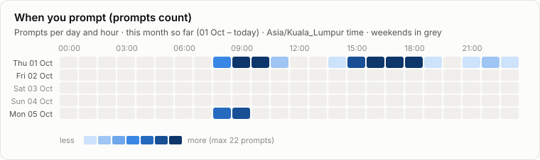
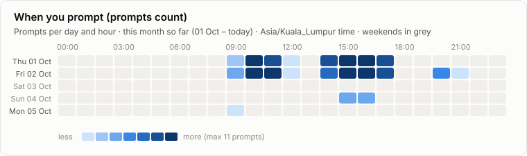
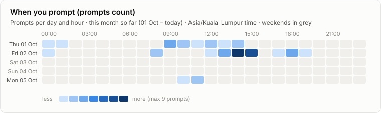
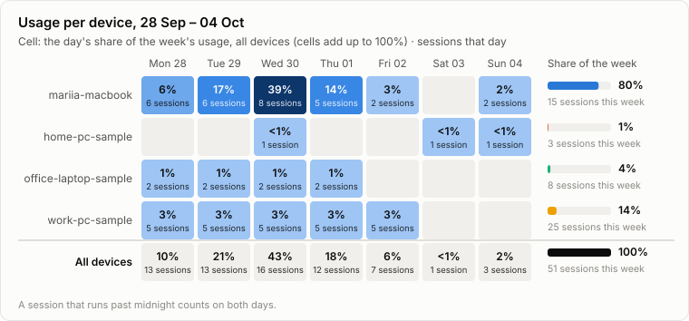
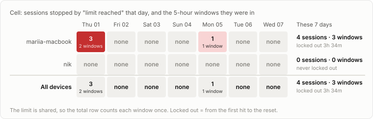
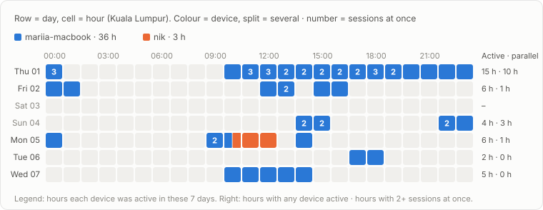
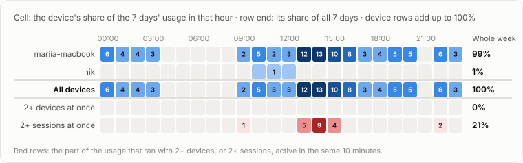

# Claude usage

Tracking since 2026-07-13 · 4 devices · 87,465 replies · 11,323 prompts

**Jump to:** [mariia-macbook](#device-mariia-macbook) · [aaron-laptop](#device-aaron-laptop) · [kenneth-laptop](#device-kenneth-laptop) · [nik](#device-nik) · [All devices](#all-devices) · [Weekly limit](#weekly-limit) · [By month](#by-month)

## Device: mariia-macbook

**This week so far (Mon 05 Oct – today):**  
20M input · 35.7K output · 91% from cache · 6 prompts · $15.02 API-equivalent  
vs the same days last week: output ▼ 96% · prompts ▼ 88% · cost ▼ 89%

## Device: aaron-laptop

_Sample data: made-up numbers that show how this device will look. They are replaced automatically when the device first syncs._

**This week so far (Mon 05 Oct – today):**  
39.8M input · 186.8K output · 96% from cache · 32 prompts · $24.75 API-equivalent  
vs the same days last week: output ▼ 78% · prompts ▼ 77% · cost ▼ 78%

## Device: kenneth-laptop

_Sample data: made-up numbers that show how this device will look. They are replaced automatically when the device first syncs._

**This week so far (Mon 05 Oct – today):**  
2.1M input · 10.5K output · 96% from cache · 2 prompts · $1.26 API-equivalent  
vs the same days last week: output ▼ 98% · prompts ▼ 98% · cost ▼ 98%

## Device: nik

**This week so far (Mon 05 Oct – today):**  
7.7M input · 82.6K output · 97% from cache · 7 prompts · $5.16 API-equivalent  
vs the same days last week: output ▼ 59% · prompts ▼ 46% · cost ▼ 71%

## All devices

Side by side, the last 7 days (29 Sep – 05 Oct).

**Cache:** every message sends the whole conversation again. The part Claude has already seen is read from the cache at about a tenth of the normal price; only the new part costs full price. The Cache column is the share of input read that way: higher is cheaper. A long conversation is re-read on every message, so starting a fresh session for a new task keeps usage down. **Share of usage:** how much of the subscription's usage in these 7 days each device took; the column adds up to 100%.

| Device | Input | Output | Cache | Prompts | Sessions | Share of usage |
| --- | ---: | ---: | ---: | ---: | ---: | ---: |
| [mariia-macbook](#device-mariia-macbook) | 3.9B | 11.1M | 98% | 288 | 13 | 68% |
| [aaron-laptop](#device-aaron-laptop) | 440.8M | 2M | 96% | 343 | 26 | 12% |
| [kenneth-laptop](#device-kenneth-laptop) | 536.8M | 2.5M | 96% | 425 | 27 | 12% |
| [nik](#device-nik) | 511.5M | 1.7M | 98% | 70 | 13 | 8% |
| **Total** | 5.4B | 17.4M | 98% | 1,126 | 79 | 100% |

vs the 7 days before: output ▲ 75% · prompts ▲ 14% · cost ▲ 22%

## Usage per device, 29 Sep – 05 Oct

## Sessions stopped by the limit, 29 Sep – 05 Oct

## Who used Claude when, 29 Sep – 05 Oct

## Usage by hour of day, 29 Sep – 05 Oct

## Weekly limit

**Weekly limit used** is the % that Claude's own `/usage` screen shows. Claude Code doesn't let scripts read it, so record it yourself: open `/usage`, then type **`/log-usage 42`** in Claude Code (42 = the weekly % it shows). The table keeps the latest reading of each week; the other columns fill in by themselves.

**Locked out time** is how long you could not use Claude because a usage limit had run out: counted from the first "limit reached" message until the moment Claude said it would reset. For example, hit at 15:17 and reset at 16:30 is 1h 13m. It is measured from Claude's own messages, not estimated. Every limit message in the logs so far is the 5-hour limit; a weekly limit message would be counted the same way.

### October 2026

| Week (Mon–Sun) | Weekly limit used | Fable limit used | 5-hour windows run out | Locked out time | Sessions | Status |
| --- | ---: | ---: | ---: | ---: | ---: | --- |
| 05 Oct – 11 Oct | – | – | 1 | 2h 56m | 10 | in progress |

### September 2026

| Week (Mon–Sun) | Weekly limit used | Fable limit used | 5-hour windows run out | Locked out time | Sessions | Status |
| --- | ---: | ---: | ---: | ---: | ---: | --- |
| 07 Sep – 13 Sep | – | – | 2 | 1h 39m | 47 | final |
| 14 Sep – 20 Sep | 100% | 100% | 5 | 9h 04m | 46 | final |
| 21 Sep – 27 Sep | 55% | 0% | 0 | – | 42 | final |
| 28 Sep – 04 Oct | 100% | 0% | 11 | 12h 46m | 88 | final |

**Recorded /usage readings** (latest 3)

| When | Device | Weekly limit | Fable limit | 5-hour limit | Resets |
| --- | --- | ---: | ---: | ---: | --- |
| Fri 02 Oct 13:00 | mariia-macbook | 100% | 0% | – | Fri 02 Oct |
| Fri 25 Sep 13:00 | mariia-macbook | 55% | 0% | – | Fri 25 Sep |
| Wed 16 Sep 13:00 | mariia-macbook | 100% | 100% | – | Fri 18 Sep |

## By month

Tokens are input (including what is read from cache) / output. Weekly and Fable limit used are the averages of the `/usage` readings dated in that month. Locked out time: the time you could not use Claude after a limit ran out, until it reset (explained under Weekly limit).

| Month | Tokens in / out | Sessions | Prompts | Devices | Windows run out | Locked out time | Weekly limit used | Fable limit used | Status |
| --- | ---: | ---: | ---: | ---: | ---: | ---: | ---: | ---: | --- |
| 2026-10 | 2B / 6.1M | 48 | 559 | 4 | 6 | 6h 54m | 100% (avg of 1) | 0% | in progress |
| [2026-09](archive/2026-09.json) | 15.3B / 45.4M | 230 | 4,090 | 4 | 15 | 21h 13m | 78% (avg of 2) | 50% | final |
| [2026-08](archive/2026-08.json) | 8.4B / 27.6M | 252 | 4,039 | 3 | 5 | 5h 32m | – | – | final |
| [2026-07](archive/2026-07.json) | 5.5B / 18.1M | 164 | 2,635 | 3 | 6 | 6h 58m | – | – | final |

## Data

- [`archive/`](archive/): one JSON file per finished month, per device and in total
- [`reports/daily.csv`](reports/daily.csv): one row per day × device × project × model
- [`reports/dashboard.html`](reports/dashboard.html): this report with hover values (download and open)
- Costs are API list prices from [`report/pricing.json`](report/pricing.json), for comparison only: a subscription is not billed per token. Models marked * are priced by their family.
- [`SETUP.md`](SETUP.md): set up a device, keep projects out, record `/usage`, rename a device
