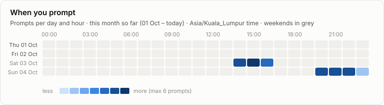
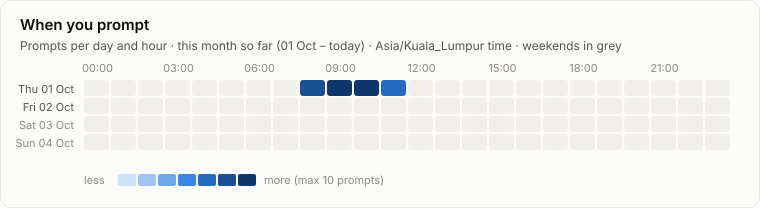
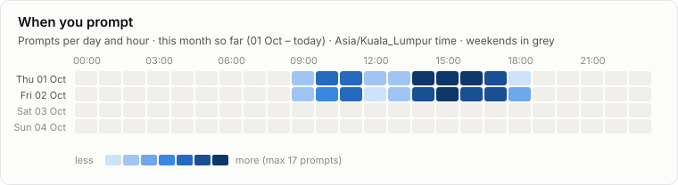
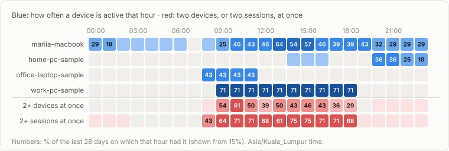

# Claude usage

Tracking since 2026-07-28 · 4 devices · 56,626 replies · 4,632 prompts

**Jump to:** [mariia-macbook](#device-mariia-macbook) · [home-pc-sample](#device-home-pc-sample) · [office-laptop-sample](#device-office-laptop-sample) · [work-pc-sample](#device-work-pc-sample) · [All devices](#all-devices) · [Plan](#plan) · [By month](#by-month)

## Device: mariia-macbook

**This week so far (Mon 28 Sep – today):**  
4.2B input · 11.8M output · 98% from cache · 319 prompts · $1,716 API-equivalent  
vs the same days last week: output ▲ 130% · prompts ▲ 31% · cost ▲ 35%

## Device: home-pc-sample

**This week so far (Mon 28 Sep – today):**  
53.9M input · 249.3K output · 96% from cache · 45 prompts · $20.62 API-equivalent  
vs the same days last week: output ▲ 321% · prompts ▲ 275% · cost ▲ 318%

## Device: office-laptop-sample

**This week so far (Mon 28 Sep – today):**  
168.7M input · 777.9K output · 97% from cache · 139 prompts · $94.82 API-equivalent  
vs the same days last week: output ▲ 42% · prompts ▲ 38% · cost ▲ 37%

## Device: work-pc-sample

**This week so far (Mon 28 Sep – today):**  
554.2M input · 2.5M output · 96% from cache · 454 prompts · $302 API-equivalent  
vs the same days last week: output ▲ 2% · prompts ▲ 3% · cost ▲ 2%

## All devices

Side by side, this week so far (Mon 28 Sep – today).

**Cache:** every message sends the whole conversation again. The part Claude has already seen is read from the cache at about a tenth of the normal price; only the new part costs full price. The Cache column is the share of input read that way: higher is cheaper. A long conversation is re-read on every message, so starting a fresh session for a new task keeps usage down. **Share of usage:** how much of the subscription's usage this week each device took; the column adds up to 100%.

| Device | Input | Output | Cache | Prompts | Sessions | Share of usage |
| --- | ---: | ---: | ---: | ---: | ---: | ---: |
| [mariia-macbook](#device-mariia-macbook) | 4.2B | 11.8M | 98% | 319 | 15 | 80% |
| [home-pc-sample](#device-home-pc-sample) | 53.9M | 249.3K | 96% | 45 | 3 | 1% |
| [office-laptop-sample](#device-office-laptop-sample) | 168.7M | 777.9K | 97% | 139 | 8 | 4% |
| [work-pc-sample](#device-work-pc-sample) | 554.2M | 2.5M | 96% | 454 | 25 | 14% |
| **Total** | 4.9B | 15.3M | 98% | 957 | 51 | 100% |

vs the same days last week: output ▲ 87% · prompts ▲ 20% · cost ▲ 30%

## Usage per device, 28 Sep – 04 Oct

## Sessions stopped by the limit, 28 Sep – 04 Oct

## Who used Claude when, 28 Sep – 04 Oct

## A typical day, last 28 days

## Plan

_Set your plan to see the % of its price used each week: `python3 collector/collect.py plan "Max 20x" 200`._

Only projects this tracker collects are counted. **/usage** is the weekly-limit % you recorded by hand that week (the latest reading; the limit resets on its own schedule, not on Mondays).

### September 2026

| Week (Mon–Sun) | API cost | % of plan's weekly price | /usage | Status |
| --- | ---: | ---: | ---: | --- |
| 07 Sep – 13 Sep | $1,978 | – | – | final |
| 14 Sep – 20 Sep | $585 | – | – | final |
| 21 Sep – 27 Sep | $1,636 | – | – | final |
| 28 Sep – 04 Oct | $2,133 | – | – | in progress |

_Record a reading: open `/usage` in Claude Code, then run `python3 ~/.claude-usage/repo/collector/collect.py usage 42` (add `--session 15`, `--resets "Thu 10:00"`, or `--at "2026-09-28 14:30"` for an earlier reading)._

## By month

| Month | API cost | Output | Prompts | Most-used device | Status |
| --- | ---: | ---: | ---: | --- | --- |
| 2026-10 | $549 | 4.1M | 333 | mariia-macbook | in progress |
| [2026-09](archive/2026-09.json) | $6,753 | 37.7M | 3,480 | mariia-macbook | final |
| [2026-08](archive/2026-08.json) | $2,197 | 7M | 681 | mariia-macbook | final |
| [2026-07](archive/2026-07.json) | $561 | 3M | 138 | mariia-macbook | final |

## Data

- [`archive/`](archive/): one JSON file per finished month, per device and in total
- [`reports/daily.csv`](reports/daily.csv): one row per day × device × project × model
- [`reports/dashboard.html`](reports/dashboard.html): this report with hover values (download and open)
- Costs are API list prices from [`report/pricing.json`](report/pricing.json), for comparison only: a subscription is not billed per token. Models marked * are priced by their family.
- [`SETUP.md`](SETUP.md): set up a device, keep projects out, record `/usage`, rename a device
